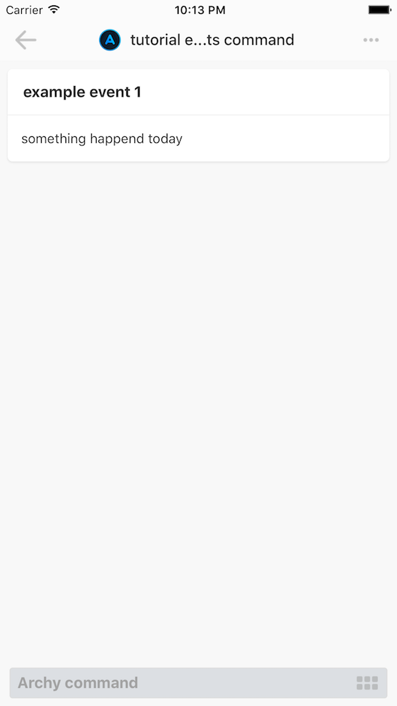

# Writing your first Archy Integration

Integration is an HTTP server. When User interacts with Archy, Archy sends requests to related Integrations. In this tutorial we will show how to create a simple integration .

This tutorial uses _archy-sdk_, it hides protocol implementation from a developer. We recommend to use _archy-sdk_, it should save you from re-factoring, when we change protocol \(and we planing changes\).

You can deploy your command anywhere. In this tutorial, we use Heroku, but feel free to contact us if you have questions about other platforms.

The tutorial assumes that you have [a free Heroku account](https://signup.heroku.com/signup/dc), and that you have [Node.js and npm](https://nodejs.org/en/download/) installed locally, and [Heroku CLI tools installed](https://devcenter.heroku.com/articles/heroku-command-line#download-and-install).

## Step 1. Set Up

_In this step you will create heroku app, and learn about Command Endpoint.  
_

**Create git repository and Heroku app**

In new empty directory, use `git init` and `heroku create` commands:

Example of output:

```bash
$ git init
Initialized empty Git repository in /path/to/your/command/.git/
$ heroku create
Creating app... done, ⬢ limitless-reef-53583
https://limitless-reef-53500.herokuapp.com/ | https://git.heroku.com/limitless-reef-53500.git
```

Remember the endpoint, created for your new heroku app, you will need it later. In the output above it's [https://limitless-reef-53500.herokuapp.com](https://limitless-reef-53500.herokuapp.com).

You can always lookup heroku app endpoint using `heroku info`.

**Create a package.json file with dependencies**

Create a package.json file with following content:

```json
{
  "version": "0.0.1",
  "scripts": {
    "start": "node index.js"
  }
}
```

**It's important** that your package.json file has declaration of a start script.

Add archy-sdk as a dependency:

```
npm install --save archy-sdk
```

## Step 2. Write first code

Now that we have setup everything, let's write some code.

In package.json above we specified index.js as a start script. Here is the full content of the script with comments.

**Create index.js file with the following content.**

```javascript
// import archy sdk, provides a basic http server and implements archy protocol
var archy = require('archy-sdk');

// command is described as an object
// only one required property - handler
// handler - is a function, that will be processing all requests from Archy
var showEvents = {
  handler: function () {
    // it must return array of objects
    return [{
      id: 1,
      title: "example event 1",
      text: "something happend today"
    }];
  }
};

// create new archy app instance and add new commands
var app = archy.App({
  commands: {
    'events': showEvents,
  }
});

// start HTTP server
// by default port 3000
app.start();
```

Now you can make your first commit and deploy new command:

```
$ git add .
$ git commit -m "Init command"
$ git push heroku master
```

`git push heroku master`  will push to remote heroku repositry and trigger auto-deployment. Heroku will auto-detect that you have node.js application and all required deployment actions.

After that you should be able to make POST requests to your new command:

```
curl -X POST -H "Content-Type: application/json" -d '{"payload":{ "perPage": null, "page": 1, "meta": {}, "args": {}}}' "https://your_heroku_app_endpoint/events"
```

Don't forget to replace _your\_heroku\_app\_endpoint_. Use `heroku info`, if forgot your heroku app endpoint.

Command should return to you JSON object with some metadata.

## Step 3. Add command to Archy App

Now it's time to test your command with Archy App. Download it for [iOS](https://archy.ai/downloads/ios) or [Android](https://archy.ai/downloads/android) if you did not do it before.

To test command in Archy app, you need to add it to Archy registry. This is a simple process, you don't need to create any accounts for that.

**Just go to **[**Create New Command page**](https://archy.ai/developer/command/add)** and register your new command.**

You will need to:

* specify your email address \(you will recieve link to edit your command later\).
* specify an endpoint to your command. Use Heroku app endpoint for that.

## Step 4. Test Command

Now when you succesfully added command to archy registry, you should be able to get a sharable link.

**Open Share link to your new command on your mobile phone. Add this command to Archy:**

**You should immidiatly see results**:



